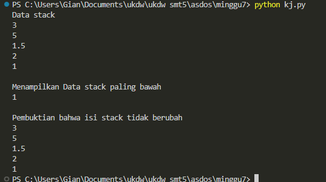

[](https://classroom.github.com/a/sh1RLPis)
# UG7 TIPE 1 STACK

## JANGAN MENGERJAKAN DI FILE KALIAN SENDIRI. KERJAKAN DI (***main.py***)

Anda diberikan sebuah class Stack dengan methode sebagai berikut:

- getLen():
  
  method ini mengembalikan banyak elemen pada Stack
- pop () :
  
  method ini mengeluarkan data yang paling terakhir masuk dan mengembalikannya kepada user
- top() :
  
  method ini membaca data yang paling atas
- push(data) :
  
  method ini menerima data dengan tipe apa saja dan akan memasukkannya ke dalam stack

- printData():
  
  method ini akan menampilkan semua data yang ada pada stack mulai dari data yang paling baru masuk sampai yang paling lama berada di stack

Tugas Anda sekarang adalah melengkapi sebuah fungsi bernama def printDataPertama(stack). Ingat, fungsi ini bukan method yang berada di dalam class stack. Fungsi ini akan menerima parameter berupa tipe data Stack dan akan mengambil data yang paling bawah di stack alias yang paling pertama masuk. Isi stack harus sama seperti semula.

**KALIAN HANYA BOLEH MENGGUNAKAN METHOD METHOD YANG TERSEDIA DI DALAM CLASS STACK TERSEBUT, SANGAT DILARANG MENGAKSES DATA _data DAN _size SECARA LANGSUNG PADA PROGRAM KALIAN (JIKA NEKAT AKAN DIKURANGI NILAINYA SESUAI MOOD PAK DENDY)**

## TEST CASE
```
if __name__ == "__main__":
    # Test Case pada program
    # jangan diganti. jika mau diganti, harus dikembalikan
    # ke keadaan semula saat pengumpulan
    
    # mengisi stack
    s = Stack()
    s.push(1)
    s.push(2)
    s.push(1.5)
    s.push(5)
    s.push(3)

    print("Data stack")
    s.printData()
    print()
    print("Menampilkan Data stack paling bawah")
    printDataPertama(s)
    print()
    print("Pembuktian bahwa isi stack tidak berubah")
    s.printData()
```

## OUTPUT
